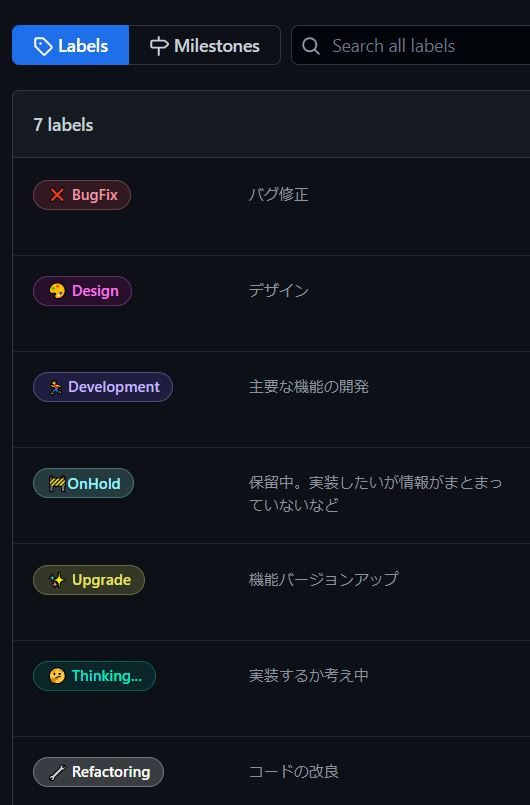
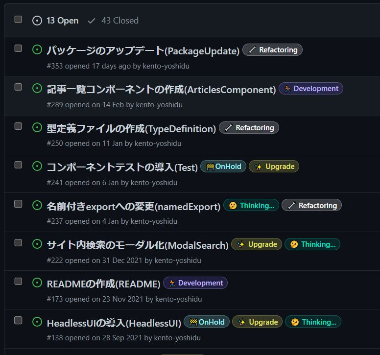
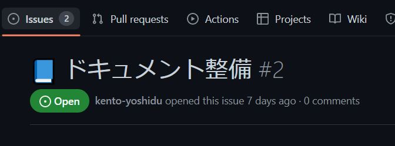
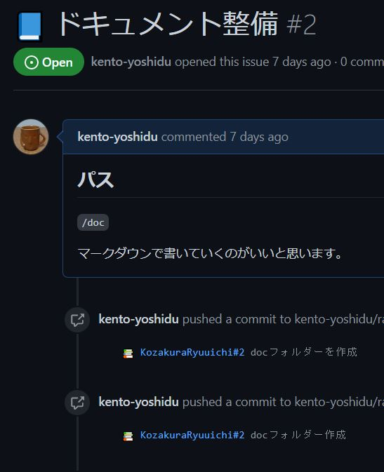
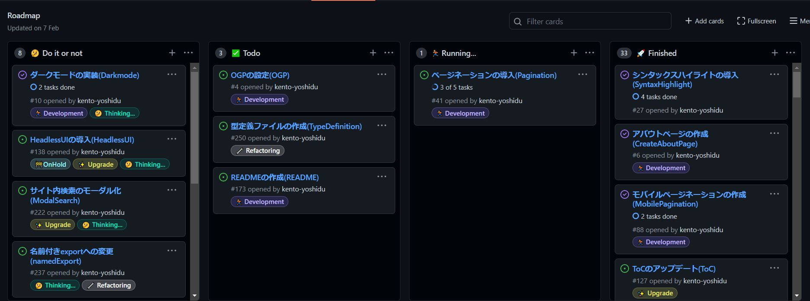

# 参考

僕はいつもこんな感じでやってます。新しいリポジトリ作るときにでも参考に。

## issue

イシュー駆動開発。タスク、問題点、バグフィックスなどごとにissueを切って、これをこなしていくことで開発を進めます。粒度が細かすぎてもしんどいので、ある程度の大きさにします。

例えば、

- MySQLとの連携
- ログイン機能の実装
- トップページのデザイン実装
- ユーザー認証部分のリファクタ
- 記事投稿後勝手にログアウトする

など。

### ラベル

各issueにはラベルをつけられます。こんな感じ。

これを各issueに割り当てることでissueを分類できます。

## ブランチ名

issueを基にブランチを切ります。issueを発行するとナンバーが発行されます。以下画像なら`#2`。このナンバーを含めてブランチ名を考えます。

例えば機能追加なら`feature/#2_document`という風にします。バグフィックスなら`bugfix/#5_MySQLConnectError`など。

コミットメッセージにissueのナンバーを含めるようにします。例えば`✨ #2 docフォルダーを作成`など。こうすることでissueとコミットが紐づきます。

## projects

GitHubのprojects機能を使ってプロジェクト全体を管理できます。

新しくissueを切ったら「Do it or not」か「Todo」に入れて、作業完了したらissueをcloseして「finished」に移動させる、など。

[参考](https://github.com/kento-yoshidu/GatsbyBlog/projects/1)
